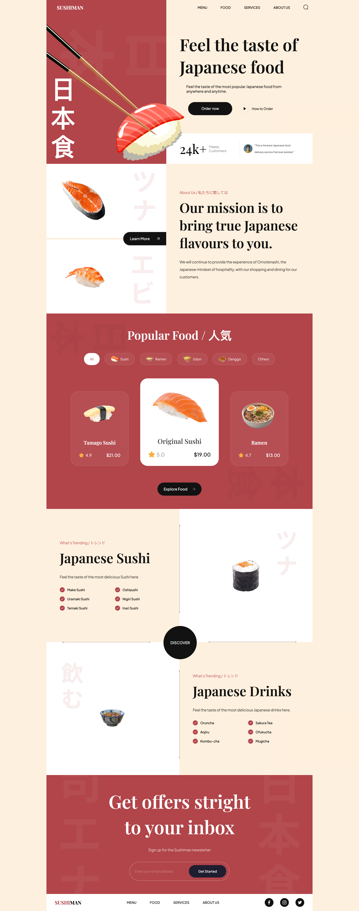

 
<h1 align='center'>Sushiman</h1>

<h2>About the project</h2>

This is the site of a restaurant specializing in Japanese food.

👉 Live Demo: <a href='https://sushiman-zeta.vercel.app/' target="_blank">Sushiman Demo</a>

<h3>Build with:</h3>

<h4>» Frontend</h4>

<h2>Screenshots of the Project 📸</h2>
 
<h3 align='center'>Home Page 🏠</h3>

